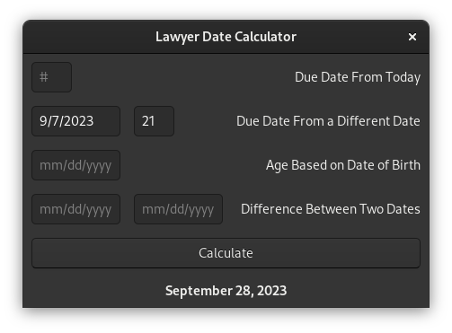

# lawyer-date-calculator
Simple date calculator that may be useful to lawyers who need to meet court deadlines. You can use a single digit for the month or day, but must use four digits for the year. Instead of clicking on the submit button, you can also just press enter.

